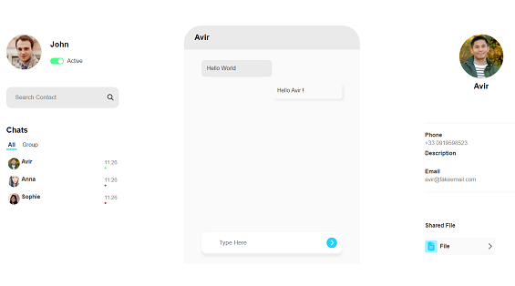

# Messagerie instantanée

## Description

Site de messagerie instantanée, avec un rendu côté serveur (SSR). Utilisation du framework Fastify, de la librairie _socket.io_. Base de données avec mySQL.

**Tags**: _SSR, Fastify, socket.io, mySQL_

<p align="center">
  
</p>

## Installation

```
npm install
```

Afin d'installer toutes les librairies

### `Créer un fichier .env`

Créer un fichier .env afin de stocker vos propres variables d'environnement.
4 varibles suivantes à définir afin de vous connecter à votre base de données mySQL.

DB_HOST= exemple: "localhost"  
DB_DATABASE= nom de votre base de données  
DB_USERNAME= exemple: "root"  
DB_PASSWORD= mot de passe

```
npm run dev
```

Une version de Node 18.11 minimmum est requise (utilisation du flag --watch)
